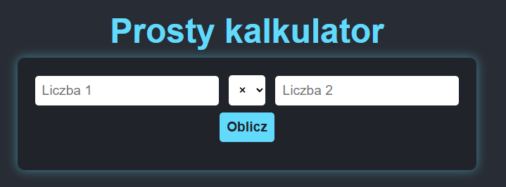

# 🐍 Python Project – Flask Calculator App

Prosty projekt webowy w języku Python z wykorzystaniem frameworka **Flask**.  
Zawiera prosty kalkulator potęgowania oraz pełne wdrożenie CI/CD na platformie **Render**.



---

## 🚀 Deployment – Render + GitHub Actions

Aplikacja została skonfigurowana do automatycznego wdrażania na platformę **Render** za pomocą GitHub Actions.

### ✅ Kiedy następuje deployment:
- Po każdym pushu do gałęzi `main`
- Gdy testy przejdą pomyślnie (`tests/`)
- Sekrety środowiskowe są poprawnie skonfigurowane (`RENDER_API_KEY`)

### 🔁 Proces:
1. `build-and-test` – instalacja zależności i testowanie aplikacji
2. `deploy` – wywołanie API Rendera w celu uruchomienia nowej wersji
3. `health check` – sprawdzenie `/health`, by potwierdzić poprawne wdrożenie

### 🔙 Rollback:
- Możesz uruchomić `rollback.yml` ręcznie z zakładki **Actions** → *Run workflow*
- Wpisz `commit_sha`, aby cofnąć aplikację do konkretnej wersji

### 🌍 Link do aplikacji:
🔗 [https://python-project-a0z3.onrender.com](https://python-project-a0z3.onrender.com)

---

## 🧪 Funkcjonalności

- Prosty **kalkulator potęgowania**
- Strona główna z interfejsem HTML
- Endpoint `/health` z informacją o stanie aplikacji

---

## 🛠️ Technologie

- Python 3.12
- Flask
- Git + GitHub Actions
- Render (Deployment)

---

## 🧾 Instalacja lokalna

```bash
git clone https://github.com/badmintonenjoyer/python-project.git
cd python-project
python -m venv venv
source venv/bin/activate  # Linux/macOS
venv\Scripts\activate     # Windows
pip install -r requirements.txt
python src/main.py

Przykład funkcji poteguj
python
Kopiuj
Edytuj
from kalkulator import poteguj

print(poteguj(2, 3))  # wynik: 8

## 👨‍💻 Autor
Szymon Rochowicz
GitHub – @badmintonenjoyer
📧 wrx86272@student.wroclaw.merito.pl